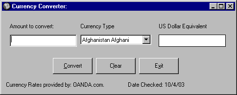



## A Simple Currency Converter\!

### Description

This is a simple currency convert that converts 10 different currencies to US dollar amounts. All currency rates were taken as of 10/4/2003
 
### More Info
 

             |
---                |---
**Submitted On**   |2003-10-04 01:43:50
**By**             |[Randy McCleary](https://github.com/Planet-Source-Code/PSCIndex/blob/master/ByAuthor/randy-mccleary.md)
**Level**          |Intermediate
**User Rating**    |4.8 (19 globes from 4 users)
**Compatibility**  |VB 6\.0
**Category**       |[Miscellaneous](https://github.com/Planet-Source-Code/PSCIndex/blob/master/ByCategory/miscellaneous__1-1.md)
**World**          |[Visual Basic](https://github.com/Planet-Source-Code/PSCIndex/blob/master/ByWorld/visual-basic.md)
**Archive File**   |[A\_Simple\_C1653641042003\.zip](https://github.com/Planet-Source-Code/randy-mccleary-a-simple-currency-converter__1-48987/archive/master.zip)

